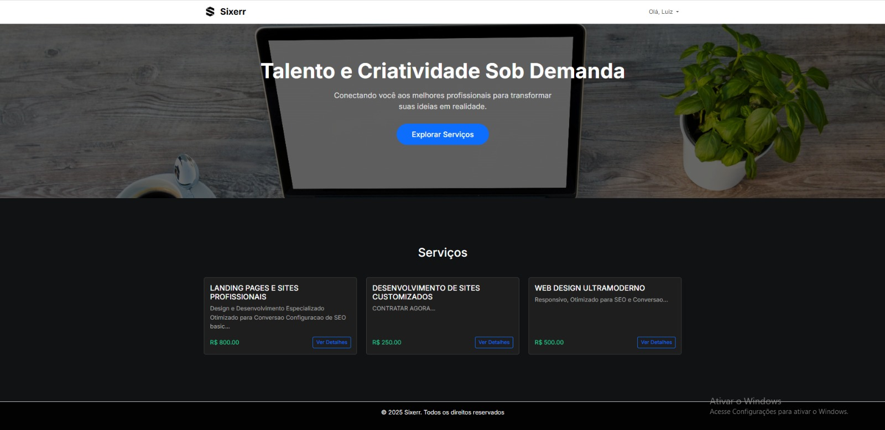
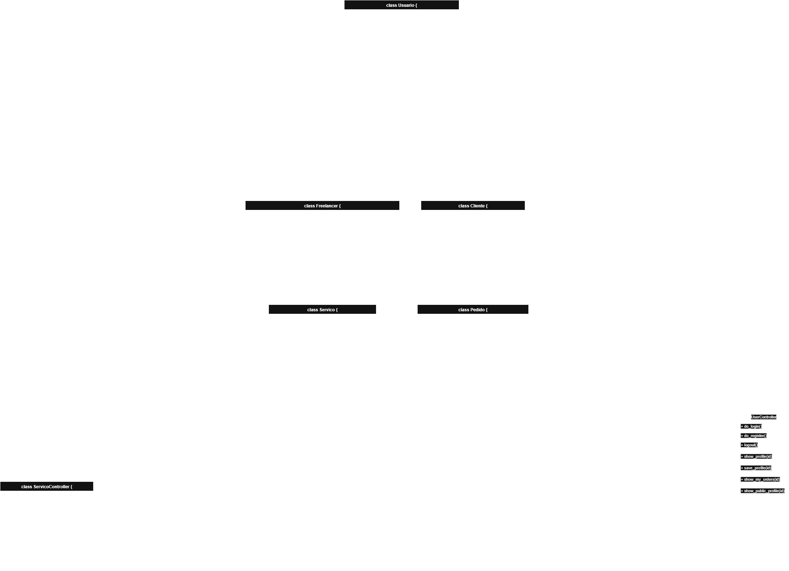

# 🛍️ Sixerr Marketplace


*Projeto final da disciplina de Orientação a Objetos. Sixerr é um marketplace web funcional desenvolvido em Python com o micro-framework Bottle, que conecta freelancers a clientes de forma simples e eficiente.*

---

### 📝 Sobre o Projeto

O Sixerr foi concebido como uma solução para o desafio de conectar talentos a oportunidades. Inspirado em plataformas de freelancing consagradas, este projeto aplica os quatro pilares da Programação Orientada a Objetos (Abstração, Encapsulamento, Herança e Polimorfismo) para criar um sistema robusto e modular.

A arquitetura segue o padrão **Model-View-Controller (MVC)**, garantindo uma separação clara entre a lógica de negócio (Controllers), a manipulação dos dados (Models) e a apresentação (Views), o que resulta num código mais limpo, manutenível e escalável.



---

### ✨ Funcionalidades Principais

O Sixerr conta com um ciclo completo de funcionalidades para dois tipos de utilizadores: **Clientes** e **Freelancers**.

#### **Funcionalidades Gerais**
* 👤 **Sistema de Autenticação:** Registo diferenciado para Clientes e Freelancers e sistema de login seguro.
* 🔐 **Proteção de Rotas:** Utilização de decorators para garantir que apenas utilizadores logados (e com a permissão correta) possam acessar determinadas páginas.
* 🎨 **Interface Customizada:** Um design moderno e consistente, com tema escuro para as áreas de gestão.
* 💳 **Carteira Virtual:** Cada utilizador possui uma carteira para gerir um saldo fictício.
* ❌ **Páginas de Erro Personalizadas:** Páginas de erro 403 (Acesso Negado) e 404 (Não Encontrado) integradas ao design do site.

#### **Funcionalidades do Cliente**
* 🔍 **Explorar Serviços:** Visualização de todos os serviços disponíveis na plataforma.
* 📄 **Ver Detalhes:** Acesso a uma página de detalhes para cada serviço.
* 👨‍💻 **Ver Perfil do Freelancer:** Capacidade de visualizar o perfil público do freelancer que oferece um serviço.
* 💰 **Depositar Dinheiro:** Opção de adicionar fundos à sua carteira virtual.
* 🛒 **Contratar Serviço:** Fluxo completo de contratação, com o valor do serviço a ser debitado do seu saldo e transferido para o freelancer.
* 📋 **Histórico de Pedidos:** Uma página dedicada ("Meus Pedidos") para ver todos os serviços que já contratou.

#### **Funcionalidades do Freelancer**
* 🛠️ **Gestão de Serviços (CRUD):** Um freelancer pode Criar, Ler, Atualizar e Excluir os seus próprios serviços num painel de controlo dedicado.
* प्रोफाइल **Perfil Completo e Editável:** Perfil detalhado com biografia, habilidades, portfólio e informações de contato que podem ser editados.
* 📈 **Histórico de Vendas:** Uma página dedicada ("Minhas Vendas") para ver o histórico de todos os serviços que já vendeu, para qual cliente e por qual valor.
* 💸 **Sacar Dinheiro:** Opção de retirar fundos da sua carteira virtual.

---

### 🛠️ Tecnologias Utilizadas

* **Backend:** Python 3
* **Framework:** Bottle
* **Banco de Dados:** SQLite 3
* **Frontend:** HTML5, CSS3, JavaScript (para interações dinâmicas no formulário)
* **Framework CSS:** Bootstrap 5

---

### 📂 Estrutura do Projeto

A organização dos ficheiros segue o padrão Model-View-Controller (MVC):

```
epf-Sixerr/
├── controllers/
│   ├── base_controller.py
│   ├── servico_controller.py
│   └── user_controller.py
├── data/
│   └── database.py
├── docs/
│   ├── diagrama-epf-OO.png
│   └── print_homepage.png
├── models/
│   ├── cliente.py
│   ├── freelancer.py
│   ├── pedido.py
│   ├── servico.py
│   └── usuario.py
├── static/
│   └── css/
│       ├── custom.css
│       ├── login.css
│       └── meus_servicos.css
│   └── img/
│       ├── BottleLogo.png
│       ├── logo.png
│       └── logo2.jpeg
├── views/
│   ├── carteira.tpl
│   ├── error_404.tpl
│   ├── home.tpl
│   ├── layout.tpl
│   ├── login.tpl
│   ├── meus_pedidos.tpl
│   ├── meus_servicos.tpl
│   ├── minhas_vendas.tpl
│   ├── perfil.tpl
│   ├── perfil_cliente.tpl
│   ├── perfil_editar.tpl
│   ├── perfil_publico.tpl
│   └── register.tpl
├── .gitignore
├── app.py
├── config.py
├── main.py
├── Makefile
└── requirements.txt
```
---

## 🚀 Como Rodar o Projeto

Siga os passos abaixo para executar o projeto localmente.

```bash
# 1. Clone o repositório para a sua máquina
git clone https://github.com/Heitorovski01/epf-Sixerr.git

# 2. Navegue até a pasta do projeto
cd epf-Sixerr

# 3. Crie um ambiente virtual
python -m venv venv

# 4. Ative o ambiente virtual
# No Windows (PowerShell):
. .\venv\Scripts\activate
# No macOS/Linux:
source venv/bin/activate

# 5. Instale as dependências
pip install -r requirements.txt

# 6. Delete qualquer base de dados antiga (se existir) para garantir uma estrutura limpa e execute a aplicação. O banco será criado automaticamente.
python main.py

# 7. Abra o seu navegador e acesse http://localhost:8080

---
```

### UML - Diagrama de Classes

A arquitetura Orientada a Objetos do projeto pode ser visualizada no seguinte diagrama:



---
```
👥 Autores
[Luiz Henrique Tomaz Moreira] - lht.unb@gmail.com

[Heitor Pinheiro Gonçalves das Chagas] - heitorbsbdf@gmail.com
```